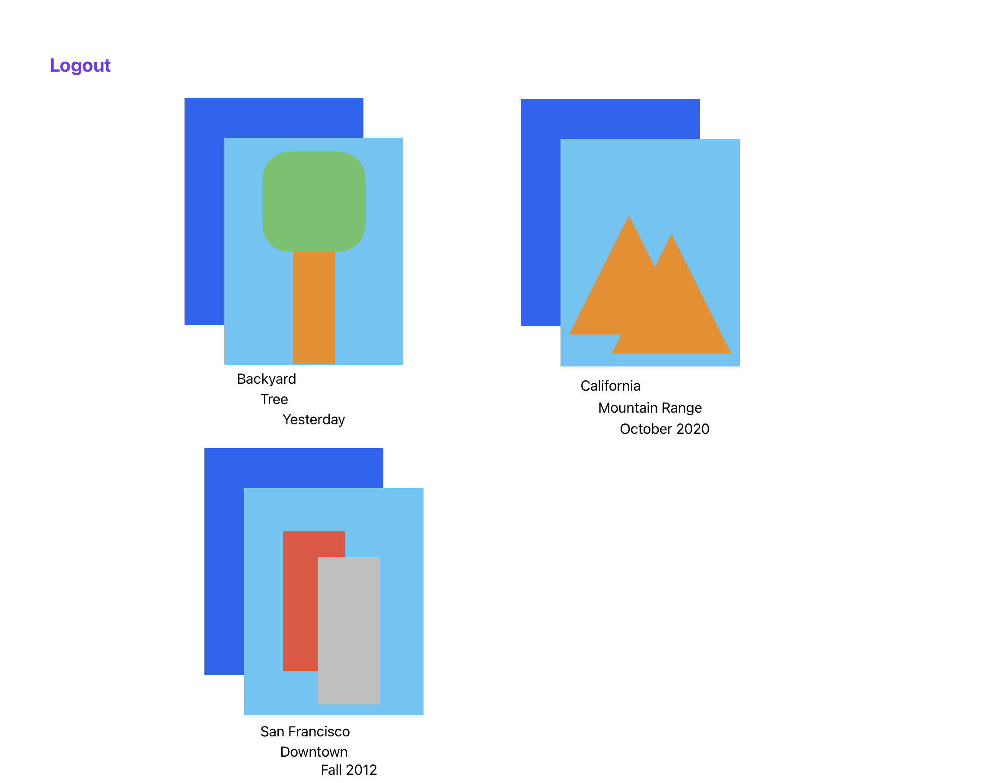
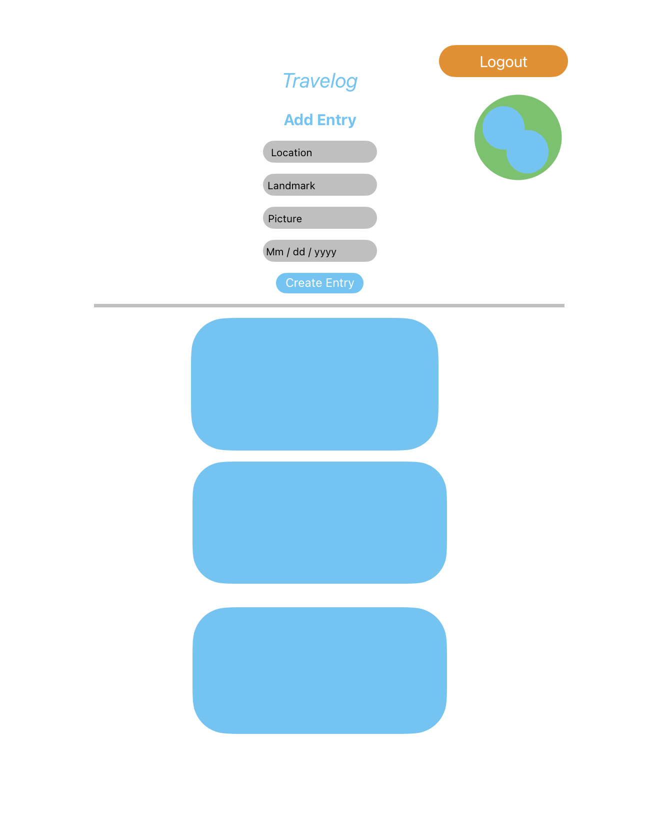

# Travelog - Frontend
- **Project Name:** Travelog
- **Project By:** Paul Bunda, Susie Gordon, Nicholas Smith

## Links
- [**Github**](https://github.com/choisus08/GroupProject_frontend)
- [**Deployment**](https://groupproject-backend.onrender.com/)
- [**Trello**](https://trello.com/b/OgGQnwAX/mern-group-project)

## Description
Travelog is a travel diary site where users can view, post, edit, and delete posts that include information about places they've traveled to. The data model for each post will be an "Entry", and each entry may include a place, a landmark, an image, and dates. Data for the app will be stored, retrieved from, added to, and deleted from the Mongo Database site connected via the Mongoose ODM library. The site is built using RESTFul routes architecture using JavaScript, a Node environment, Express framework, React library, and styled using SCSS and CSS.

## Approach
Our call to the backend API was coded in the loaders.js page along with the auth check logic which we added after reaching full CRUD capability. Our CRUD actions were coded into the actions.js file where each action was coded to hit the corresponding route on the backend API, allowing those actions to function properly for the user. The visible UI was written into the 'components' and 'pages' folders, and also makes use of our API in order to render relevant data programatically from entries in our database. 

## Technologies Used
- MongoDB
- Express
- React 
- Node
- Javascript
- CSS/SASS
- Google Fonts

## React Routes

| NAME   | PATH        |
| ------ | ----------- |
| INDEX  | /           |
| SHOW   | /:id        |
| CREATE | /create     |
| UPDATE | /update/:id |
| DELETE | /delete/:id |

## Components
- Header.js
- Index.js
- Main.js
- Show.js

## Installation
- `Fork` and `clone` this respository
- `cd` into the directory on your local machine
- Open this repository in your code editor and run the code `npm start` to open the React app in your browser

## Mockup of UI  
-Desktop View   
-Mobile View 
